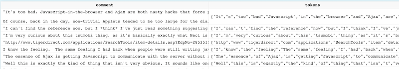

## 1. Transforming Data During Insertion

1. View the contents of the **comments.tsv** file. It consists of comments from the Hacker News website and has the following format:

| id | type | author | timestamp | comment | children |
| ---- | ---- | ---- | ---- | ---- | ---- | 
| 728625 | 	comment	| jacquesm	| 2009-07-28 19:26:13	| If there is one thing... | 	[] | 
| 728693 | 	comment	| dbz	| 2009-07-28 20:01:40	| Well to be honest... | 	[728702,729551] | 
| 728713 | 	comment	| amcclosky	| 2009-07-28 20:08:43	| I think the design of the apple UI... | 	[728776] | 

2. Define a new table named **hackernews** in the **bootcamp** database that satisfies the following requirements:
    - designed to contain the data in **comments.tsv**
    - the primary key is the _day_ of the **timestamp** column
    - the **children** column is an array of **UInt32** values
    - add a 7th column named **tokens** that is of type **Array(String)**
    - feel free to choose appropriate data types for the other columns

    
```sql
CREATE TABLE bootcamp.hackernews (
    id UInt32, 
    type String, 
    author String, 
    timestamp DateTime, 
    comment String, 
    children Array(UInt32),
    tokens Array(String)
) 
ENGINE = MergeTree 
ORDER BY toYYYYMMDD(timestamp) 
```
    

3. Insert the **comments.tsv** file into the **hackernews** table using the **clickhouse client**. During the insert, perform the following modifications to the incoming rows:
    - lower case the **author** column
    - leave the **comment** value as is, but parse the **comment** into tokens using the **extractAll** function and `'\\w+'` as the separator. Save the result as the **tokens** column. For example, if **comment** is equal to "Well to be honest" then **tokens** should be **["Well", "to", "be", "honest"]**
    - the other columns do not need any modifications during ingestion


    
```bash
./clickhouse client --query "
    INSERT INTO bootcamp.hackernews
    SELECT
        id,
	   	type,
   		lower(author),
		timestamp,
		comment,
		children,
		extractAll(comment, '\\w+') as tokens
    FROM input('id UInt32, type String, author String, timestamp DateTime, comment String, children Array(UInt32)')
    FORMAT TSV
" < comments.tsv
```
    

4. Verify that 1,000 rows were inserted:
    ```sql
    SELECT count(*) FROM bootcamp.hackernews
    ```

5. Verify your **tokens** field worked:
    ```sql
    SELECT comment,tokens FROM bootcamp.hackernews
    ```



6. Make sure your **author** values are all lowercase:
    ```sql
    SELECT author FROM bootcamp.hackernews
    ```

## 2. Storing Data in Files

{}
You can create a ClickHouse table where ***the data is stored in a file*** on the local filesystem. Changes made to the table are reflected in the local file. It is a great way to query files, and also opens up the world of ClickHouse functions that can be used to transform data in files.
{}

1. Suppose we have the following tab-separated data:

    ```
    1	Shape of You	Ed Sheeran	1366885	2017-02-26	us
    2	Bad and Boujee (feat. Lil Uzi Vert)	Migos	1118661	2017-02-26	us
    3	iSpy (feat. Lil Yachty)	KYLE	1089250	2017-02-26	us
    4	Something Just Like This	The Chainsmokers	1031807	2017-02-26	us
    5	Bounce Back	Big Sean	919101	2017-02-26	us

    ```    


2. Define a new table in the **bootcamp** database that satisfies the following requirements:
    - the name of the table is **my_data**
    - the following columns are defined
        ```sql
        daily_rank		UInt8,
        song_title		String,
        artist		    String,
        streams		    UInt64,
        date		    Date,
        region		    FixedString(2) 
        ```
    - the **ENGINE** is of type **File(TabSeparated)**

    
```sql
CREATE TABLE bootcamp.my_data (
    daily_rank		UInt8,
    song_title		String,
    artist		    String,
    streams		    UInt64,
    date		    Date,
    region		    FixedString(2)   
)
ENGINE = File(TabSeparated)
```
    

3. View the contents of your new table and it will generate an error. The underlying file is missing, and notice the name of the file is expected to be **data/bootcamp/my_data/data.TabSeparated**:
    ```sql
    SELECT * FROM bootcamp.my_data
    ```

4. Create a new file in the **data/bootcamp/my_data/** folder named **data.TabSeparated** that contains the data in step 1 above (just copy-and-paste).

5. Run the **SELECT** query again and you should see 5 rows:
    ```
    ┌─daily_rank─┬─song_title──────────────────────────┬─artist───────────┬─streams─┬───────date─┬─region─┐
    │          1 │ Shape of You                        │ Ed Sheeran       │ 1366885 │ 2017-02-26 │ us     │
    │          2 │ Bad and Boujee (feat. Lil Uzi Vert) │ Migos            │ 1118661 │ 2017-02-26 │ us     │
    │          3 │ iSpy (feat. Lil Yachty)             │ KYLE             │ 1089250 │ 2017-02-26 │ us     │
    │          4 │ Something Just Like This            │ The Chainsmokers │ 1031807 │ 2017-02-26 │ us     │
    │          5 │ Bounce Back                         │ Big Sean         │  919101 │ 2017-02-26 │ us     │
    └────────────┴─────────────────────────────────────┴──────────────────┴─────────┴────────────┴────────┘
    ```

6. Insert some rows into the **my_data** table:
    ```sql
    INSERT INTO bootcamp.my_data VALUES
        (6,'Havana','Camila Cabello',806840,'2018-02-26','us')
        (7,'Him & I (with Halsey)','G-Eazy',803699,'2018-02-26','us')
        (8,'Ric Flair Drip (& Metro Boomin)','Offset',788462,'2018-02-26','us')
        (9,'LOVE. FEAT. ZACARI.','Kendrick Lamar',723009,'2018-02-26','us')
        (10,'All The Stars (with SZA)','Kendrick Lamar',712971,'2018-02-26','us')
    ```

7. View the contents of **data/bootcamp/my_data/data.TabSeparated** and the new rows should appear in the file!

8. Run the following **clickhouse-client** command, which creates a new local file named **my_data.csv**:
    ```bash
    ./clickhouse client -q "SELECT song_title, artist, streams  FROM bootcamp.my_data INTO OUTFILE 'my_data.csv' FORMAT CSV"
    ```

9. View the contents of **my_data.csv**. Notice you just converted a tab-separated file into a CSV file, selecting specific columns. Fun! 
    ```
    "Shape of You","Ed Sheeran",1366885
    "Bad and Boujee (feat. Lil Uzi Vert)","Migos",1118661
    "iSpy (feat. Lil Yachty)","KYLE",1089250
    "Something Just Like This","The Chainsmokers",1031807
    "Bounce Back","Big Sean",919101
    "Havana","Camila Cabello",806840
    "Him & I (with Halsey)","G-Eazy",803699
    "Ric Flair Drip (& Metro Boomin)","Offset",788462
    "LOVE. FEAT. ZACARI.","Kendrick Lamar",723009
    "All The Stars (with SZA)","Kendrick Lamar",712971
    ```
