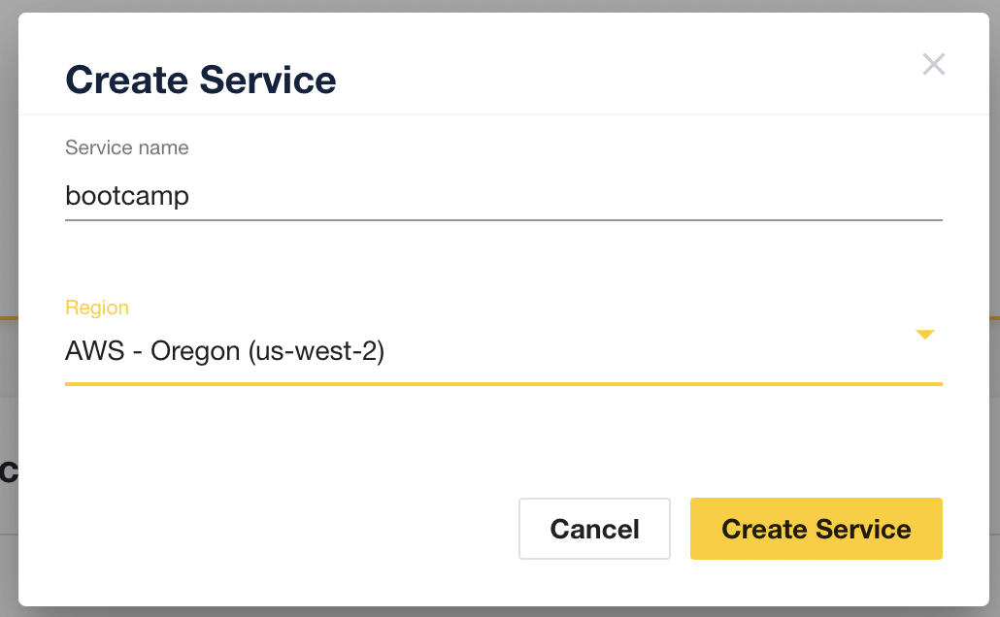
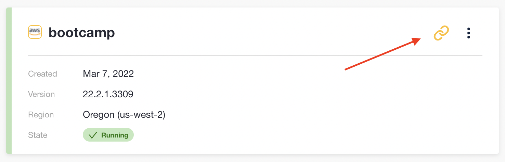
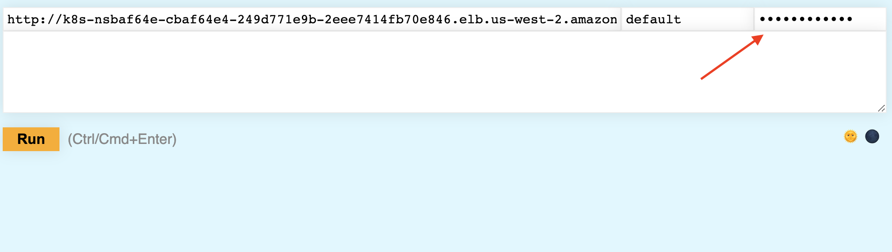
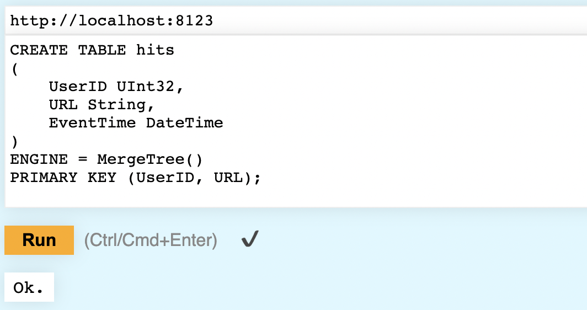
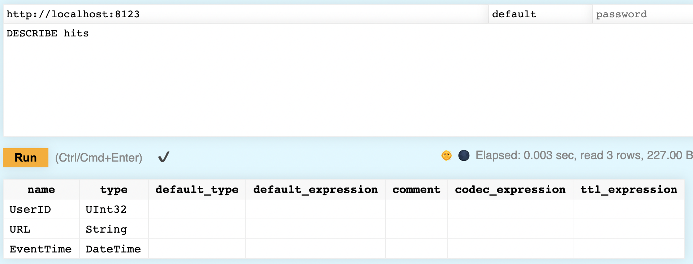

---
title: "Bootcamp"
description: "Install ClickHouse and get it up and running"
lead: "Install ClickHouse and get it up and running"
date: 
lastmod: 
draft: false
images: []
toc: true
--- 


In this lesson, you will install ClickHouse on your local machine, create a new database and table, and insert data into that table. Let's get started!

***

## 1. Installing ClickHouse

If you have a Mac or Linux system, ClickHouse is easy to download and start.  

If you have Windows, then you have a little extra work to do (because ClickHouse does not run natively on Windows). **The initial instructions below are for non-Windows users. Windows users scroll down to the Cloud Option**.

1. The first step is to open a new terminal window. On a Mac, start the **Terminal** application. On Linux, well - you know what to do.

2. Create a new directory:

```bash
mkdir bootcamp
```

3. Change into the new directory:

```bash
cd bootcamp
```

4. Download ClickHouse using the following `curl` command:

```bash
curl https://clickhouse.com/ | sh
```

This downloads a ClickHouse binary appropriate for your operating system, and makes the file executable.

5. The binary you just downloaded can be used to run lots of services and utilities. Enter the following command, which displays the usage of the `clickhouse` binary:

```bash
./clickhouse
```

The output should look like:

```bash
Use one of the following commands:
clickhouse local [args]
clickhouse client [args]
clickhouse benchmark [args]
clickhouse server [args]
clickhouse extract-from-config [args]
clickhouse compressor [args]
clickhouse format [args]
clickhouse copier [args]
clickhouse obfuscator [args]
clickhouse git-import [args]
clickhouse keeper [args]
clickhouse keeper-converter [args]
clickhouse install [args]
clickhouse start [args]
clickhouse stop [args]
clickhouse status [args]
clickhouse restart [args]
clickhouse static-files-disk-uploader [args]
clickhouse hash-binary [args]
```

6. Start the server with the following command:

```bash
./clickhouse server
```

It starts up quickly, and you should see the following output towards the end:

```bash
[ 1569110 ] {} <Information> Application: Listening for http://[::1]:8123
[ 1569110 ] {} <Information> Application: Listening for native protocol (tcp): [::1]:9000
[ 1569110 ] {} <Information> Application: Listening for MySQL compatibility protocol: [::1]:9004
[ 1569110 ] {} <Information> Application: Listening for http://127.0.0.1:8123
[ 1569110 ] {} <Information> Application: Listening for native protocol (tcp): 127.0.0.1:9000
[ 1569110 ] {} <Information> Application: Listening for MySQL compatibility protocol: 127.0.0.1:9004
[ 1569110 ] {} <Information> Application: Ready for connections.
```

*** 

## Cloud Option

If you are running Windows or prefer not to install ClickHouse locally, then follow these steps to start a ClickHouse Cloud instance:

1. Go to <a href="https://staging.control-plane.clickhouse-dev.com/" target="_blank">https://staging.control-plane.clickhouse-dev.com/</a>

2. If you are not registered yet, click the **Sign up** link. (Otherwise, login!) After you have registered, login.

3. Click the **New Service** button.

4. Enter **bootcamp** for the name of the service, and select a region close to where you live:

5. Click the **Create Service** button:



6. Wait for the new service to finish provisioning.

7. When the service is **Running**, click the links icon to view the URL and password:



8. Take a screenshot and/or copy-and-paste the details and save them somewhere. **You won't see the password again!**

9. Copy and paste just the password.

10. Close that pop-up window, then click on the three dots and select **SQL Console**. This opens the Play UI in a new tab of your web browser.

11. Paste the password into the **password** field of the Play UI:



12. Now you are ready to create a table...just ignore the first step below about opening the Play UI - you are already there!

***

## 2. Create a Table

1. The Play UI is available at <a href="http://localhost:8123/play" target="_blank">http://localhost:8123/play</a>. Click on the link to view the Play UI.

2. You can enter SQL commands in the top UI, click the **Run** button, and the results are displayed below. Run the following command to create a new database named `kubedb`:

```sql
CREATE DATABASE IF NOT EXISTS kubedb
```

{}
**Cloud users** - note that you do not have permission to define a new database, but you already have one created named `kubedb`, so you can ignore any error message and continue on to the next step.
{}

3. Create a new table named `hits` in the `kubedb` database:

```sql
CREATE TABLE kubedb.hits
(
    UserID UInt32,
    URL String,
    EventTime DateTime
)
ENGINE = MergeTree()
PRIMARY KEY (UserID, URL);
```

After clicking the **Run** button, you should get **Ok.** as a response:



3. Run the following `DESCRIBE` command to verify it worked:

```sql
DESCRIBE kubedb.hits
```

The schema of the table is returned:




## 3. Insert Data

1. Run the following command, which downloads and inserts millions of rows into your new table:

```sql
INSERT INTO kubedb.hits SELECT
   intHash32(c11::UInt64) AS UserID,
   c15 AS URL,
   c5 AS EventTime
FROM url('https://datasets.clickhouse.com/hits/tsv/hits_v1.tsv.xz')
WHERE URL != '';
```

It will take a while to execute. Leave the command running and continue to the next step.

2. Open the Play UI again in a new tab: <a href="http://localhost:8123/play" target="_blank">http://localhost:8123/play</a>

3. Run the following command, which returns the number of rows in `hits`:

```sql
SELECT count() FROM kubedb.hits
```

Run the `count()` query again until you see 8,867,681 rows.

## 4. Query Data

1. Run the following query, which returns the top 3 hits most-visited URLs:

```sql
SELECT URL, count(URL) AS Count
FROM kubedb.hits
GROUP BY URL
ORDER BY Count DESC
LIMIT 3
```

2. Which URL is the most visited?

    
`http://public_search` with 311,119 hits
    

3. How long did it take to run your query? And how many rows were processed?

    
Running it locally, I get the following result:

`Elapsed: 0.563 sec, read 8.87 million rows, 767.90 MB.`

Running it in the cloud, the results vary:

`Elapsed: 2.962 sec, read 8.87 million rows, 767.90 MB.`

    

4. Write a query that finds the most popular days of the week when a user visits `http://public_search`.

    
```sql
SELECT 
   day, 
   count() AS visits 
FROM kubedb.hits 
WHERE URL = 'http://public_search' 
GROUP BY toDayOfWeek(EventTime) AS day 
ORDER BY visits DESC
```
    

