**Duration:** 45-60 minutes

**Audience:** Anyone interested in learning how to install ClickHouse, ingest some data, and view and analyze that data using Apache Superset.




This tutorial is more of a journey...it has many moving parts to get to the final result - which is the ability to analyze data using ClickHouse and Superset. But the end result is worth the effort! I found some Covid-19 data in a CSV format, ingested it into ClickHouse, then analyzed the data visually using charts in Superset:

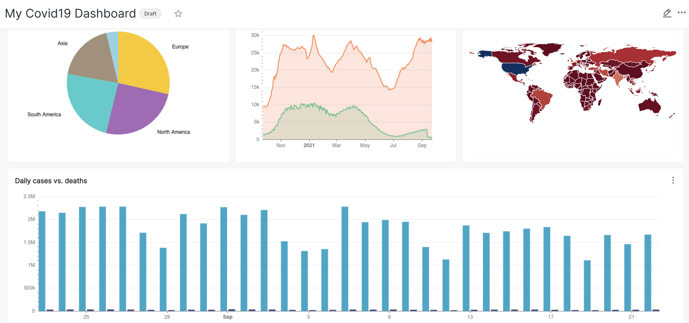

This lesson covers the following tasks:

1. Installing ClickHouse 
2. Defining a database and table
3. Ingesting CSV files into ClickHouse 
4. Installing Superset
5. Connecting Superset to ClickHouse
6. Creating charts and a dashboard in Superset

Let's get started!

***

### Prerequisites

The assumption is that you are new to ClickHouse. You will be installing ClickHouse and Superset on your local machine. ClickHouse does not run on Windows, so if you do not have a Linux or Mac OS X system, then you will need to either run Linux in a virtual machine using something like [VirtualBox](https://www.virtualbox.org/), or create a Linux instance using your favorite cloud provider.

*** 


## 1. Installing ClickHouse

  There are several ways to install ClickHouse, including DEB and RPM packages. In this tutorial, we will simply download a pre-built binary and execute it. For simplicity, I performed all of the tasks in my home directory. 



1. Start by opening a terminal and creating a folder for the ClickHouse binary:
```
mkdir clickhouse
cd clickhouse
```

2. Find your OS in the following table, then copy-and-paste the command to download a pre-built ClickHouse binary and make it executable:
<table>
    <thead>
        <tr>
            <th>OS</th>
            <th>Run this command:</th>
        </tr>
    </thead>
    <tbody>
        <tr>
            <td>MacOS x86_64</td>
            <td>
            ```
            curl -O 'https://builds.clickhouse.tech/master/macos/clickhouse' && chmod a+x ./clickhouse
            ```
            </td>
        </tr>
        <tr>
            <td>MacOS Aarch64</td>
            <td>
            ```
            curl -O 'https://builds.clickhouse.tech/master/macos-aarch64/clickhouse' && chmod a+x ./clickhouse
            ```
            </td>
        </tr> 
        <tr>
            <td>FreeBSD x86_64</td>
            <td>
            ```
            curl -O 'https://builds.clickhouse.tech/master/freebsd/clickhouse' && chmod a+x ./clickhouse
            ```
            </td>
        </tr>
        <tr>
            <td>Linux AArch64</td>
            <td>
            ```
            curl -O 'https://builds.clickhouse.tech/master/aarch64/clickhouse' && chmod a+x ./clickhouse
            ```
            </td>
        </tr>        
    </tbody>
</table>
    



*** 

## 2. Defining a database and table

Complete the following steps to startup the ClickHouse server and use the ClickHouse client to define a new database and table.




1. First, you need to start the ClickHouse server:
```
./clickhouse server
```

2. It won't take long for ClickHouse to start - but wait for the following message:
```
<Information> Application: Ready for connections.
```

3. In a new terminal, `cd` into the `clickhouse` folder and use the `clickhouse client` to define a new database named `covid19db`. Notice this command demonstrates how to submit a SQL command to ClickHouse from the command line:
```
cd clickhouse 
./clickhouse client --query "CREATE DATABASE covid19db"
```

4. The Covid-19 data has over 60 columns, and most of them are decimal numbers. It's a lot of information, but it allows us to answer a lot of questions about the pandemic. But because the schema is large, we are not going to send it using the `--query` flag. You will now learn how to submit a SQL command that is saved in a text file to a ClickHouse database. Start by creating a new text file in your home folder named `~/daily_totals.sql` that contains the following `CREATE TABLE` command:
```
CREATE TABLE IF NOT EXISTS  covid19db.daily_totals (
    `iso_code` String, 
    `continent` String, 
    `location` String, 	
    `date` Date, 
    `total_cases` Float32, 
    `new_cases` Float32, 
    `new_cases_smoothed` Float32, 
    `total_deaths` Float32, 
    `new_deaths` Float32, 
    `new_deaths_smoothed` Float32, 
    `total_cases_per_million` Float32, 
    `new_cases_per_million` Float32, 
    `new_cases_smoothed_per_million` Float32, 
    `total_deaths_per_million` Float32, 
    `new_deaths_per_million` Float32,
    `new_deaths_smoothed_per_million` Float32, 
    `reproduction_rate` Float32,
    `icu_patients` Float32, 
    `icu_patients_per_million` Float32, 
    `hosp_patients` Float32, 
    `hosp_patients_per_million` Float32, 
    `weekly_icu_admissions` Float32, 
    `weekly_icu_admissions_per_million` Float32, 
    `weekly_hosp_admissions` Float32, 
    `weekly_hosp_admissions_per_million` Float32,
    `new_tests` Float32, 
    `total_tests` Float32, 
    `total_tests_per_thousand` Float32, 
    `new_tests_per_thousand` Float32, 
    `new_tests_smoothed` Float32, 
    `new_tests_smoothed_per_thousand` Float32,
    `positive_rate` Float32, 
    `tests_per_case` Float32,
    `tests_units` Float32, 
    `total_vaccinations` Float32, 
    `people_vaccinated` Float32, 
    `people_fully_vaccinated` Float32, 
    `total_boosters` Float32, 
    `new_vaccinations` Float32, 
    `new_vaccinations_smoothed` Float32, 
    `total_vaccinations_per_hundred` Float32,
    `people_vaccinated_per_hundred` Float32, 
    `people_fully_vaccinated_per_hundred` Float32,
    `total_boosters_per_hundred` Float32, 
    `new_vaccinations_smoothed_per_million` Float32, 
    `stringency_index` Float32, 
    `population` Float32, 
    `population_density` Float32, 
    `median_age` Float32, 
    `aged_65_older` Float32, 
    `aged_70_older` Float32, 
    `gdp_per_capita` Float32, 
    `extreme_poverty` Float32,
    `cardiovasc_death_rate` Float32, 
    `diabetes_prevalence` Float32,
    `female_smokers` Float32, 
    `male_smokers` Float32, 	
    `handwashing_facilities` Float32, 
    `hospital_beds_per_thousand` Float32, 
    `life_expectancy` Float32, 
    `human_development_index` Float32, 
    `excess_mortality_cumulative` Float32,
    `excess_mortality` Float32
) 
ENGINE = MergeTree()
ORDER BY (date)
```

5. Now run the following command from the `clickhouse` folder, which executes the command in `daily_tables.sql`:
```
./clickhouse client < ../daily_totals.sql
```

6. Verify the table exists by viewing its details:
```
./clickhouse client --query "DESCRIBE covid19db.daily_totals"
```
You should see the names and data types of all the columns in `daily_totals`.




***

## 3. Ingesting CSV files into ClickHouse 

The Covid-19 data contains daily numbers from countries all over the world and was downloaded from Github here: [https://github.com/owid/covid-19-data/tree/master/public/data](https://github.com/owid/covid-19-data/tree/master/public/data). But...for some reason they decided to add random string values in some of the numeric columns, so those have been removed in the file below. [Click here to download the CSV file.](TODO - upload file somewhere)

Complete the following steps to download and insert the data into your ClickHouse table.




1. Download the following `owid-covid-data.txt` file into your `~/clickhouse` folder (for convenience): [TODO: upload file to S3](link_to_S3)

2. To insert the data into your table, run the following command:
```
cat owid-covid-data.csv | ./clickhouse client --query "INSERT INTO covid19db.daily_totals FORMAT CSV"
```



***

## 4. Installing Superset

You can install Apache Superset using Docker, but for some reason the Superset container would not let me define a new dataset for a ClickHouse table. (The database connection worked, but the dataset did not - so it was not possible to build any charts.) 

Therefore, I simply (but tediously) ran the following commands to install and run Superset in a Python virtual environment:



1. Make a new subfolder in your home folder:
```
mkdir superset
cd superset
```

2. Make sure you have `virtualenv` installed:
```
pip install virtualenv
```

3. Create a new virtual environment:
```
python3 -m venv venv
. venv/bin/activate
```

4. Make sure `pip` and `setuptools` are up-to-date:
```
pip install --upgrade setuptools pip
```

5. Install Apache Superset:
```
pip install apache-superset
```

6. Install the Superset database:
```
superset db upgrade
```

7. Create an admin user. I just used `admin` for both the username and password:
```
export FLASK_APP=superset
superset fab create-admin
```

8. The following command creates the defaults roles and permissions:
```
superset init
```

9. Don't miss this step! It installs the ClickHouse database driver for Superset, as well as a SQLAlchemy dialect that is needed by Superset:
```
pip install clickhouse-driver==0.2.0 && pip install clickhouse-sqlalchemy==0.1.6
```

9. And now you are finally ready to start Superset. Feel free to choose a different port if needed:
```
superset run -p 8088 --with-threads --reload --debugger
```

10. Open your web browser to <a href="http://localhost:8088" target="_blank">http://localhost:8088</a>. Login and you will see the welcome page for Superset:
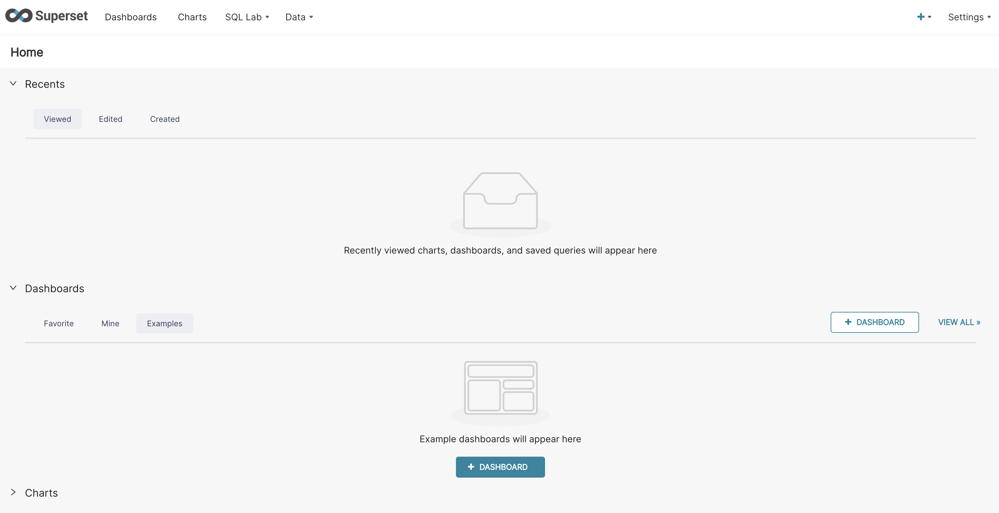





***

## 5. Connecting Superset to ClickHouse

Now that you have both ClickHouse and Superset up and running, let's connect the two of them:



1. Select **Data** from the top menu and then **Databases** from the drop-down menu. You do not have any databases defined yet, but notice there is a button to add a new one - click it:
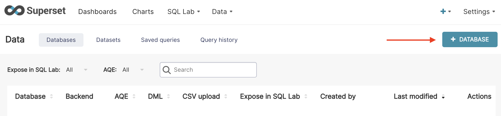

2. In the first step of the wizard that starts, select **ClickHouse** as the type of database:
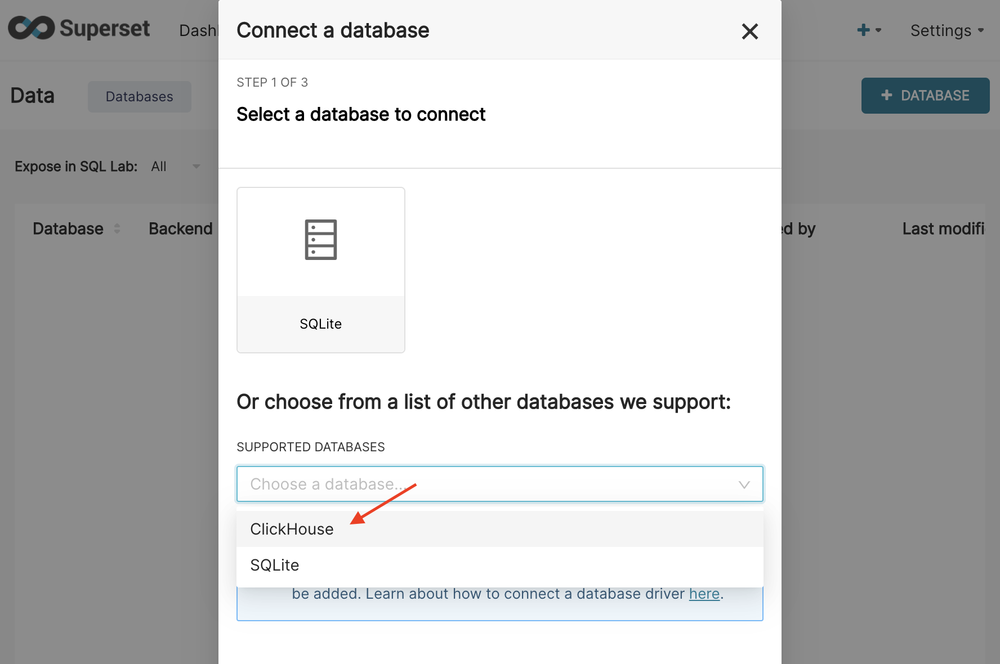

3. Enter "**Covid19 Database**" for the **DISPLAY NAME**.

4. Enter the following URI in the **SQLALCHEMY URI** field. The `default` before the `@` is actually the `usernmae:password` for ClickHouse. In this tutorial we did not define a ClickHouse user, and the `default` user does not have a password.
```
clickhouse+native://default@localhost/covid19db
```

5. Try the **TEST CONNECTION** button and verify that Superset is connecting to your ClickHouse database properly:
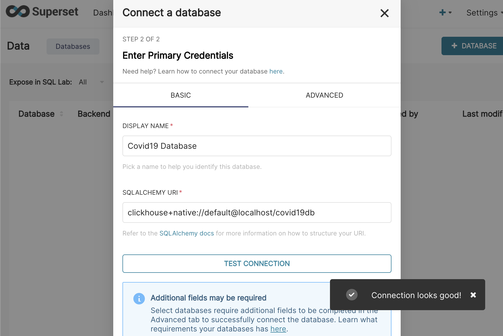


6. Click the **CONNECT** button to complete the setup wizard, and you should now see your **Covid19 Database** in the list of databases.

7. To define new charts (visualizations) in Superset, you need to define the source of the data used in the charts - which is accomplished using *datasets*. From the top menu in Superset, select **Data**, then **Datasets** from the drop-down menu. You should see an empty list - let's define one!

8. Click the button for adding a dataset. Select your new database as the datasource, **covid19db** for the schema, and **daily_totals** for the table:
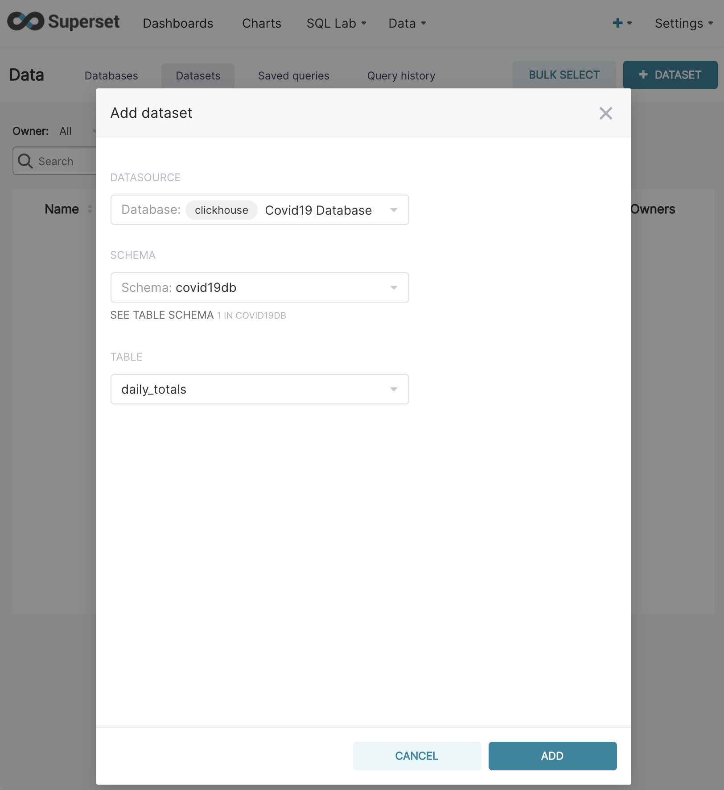


9. Click the **ADD** button at the bottom of the dialog window and you should see **daily_totals** in the list of datasets. Congratulations!! You are ready to build a dashboard and analyze the data.




***

## 6. Creating charts and a dashboard in Superset

If you are familiar with Superset, then you will feel right at home with this next section. If you are new to Superset, well...it's like a lot of the other cool visualization tools out there in the world - it doesn't take long to get started, but the details and nuances get learned over time as you use the tool. 

In this section, you will define a new dashboard and add charts (visualizations) to it. 



1. Let's start by creating a new dashboard to display our charts. From the top menu in Superset, select **Dashboards**. You should see an empty list.

2. Click the button in the upper-right to add a new dashboard. Name it **Covid-19 Dashboard** and click the **SAVE** button:
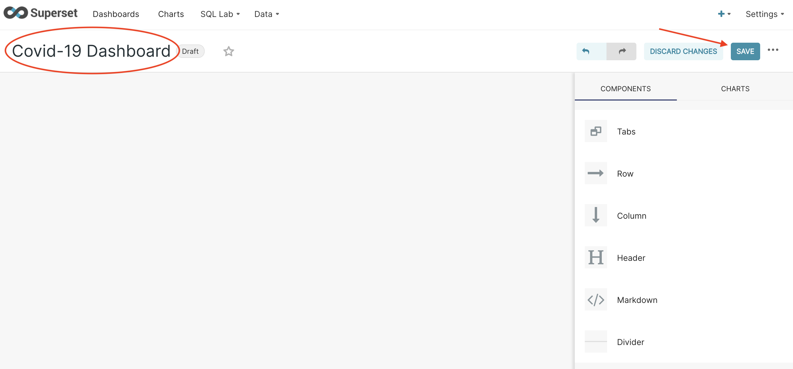

3. Now let's create a new chart. Select **Charts** from the top menu and click the button to add a new chart. You will be shown a lot of options. For starters, select the **Big Number** chart. You will need to also choose a dataset, so select **daily_totals** from the **CHOOSE A DATASET** drop-down. When you are ready, click the **CREATE NEW CHART** button in the bottom-right corner:
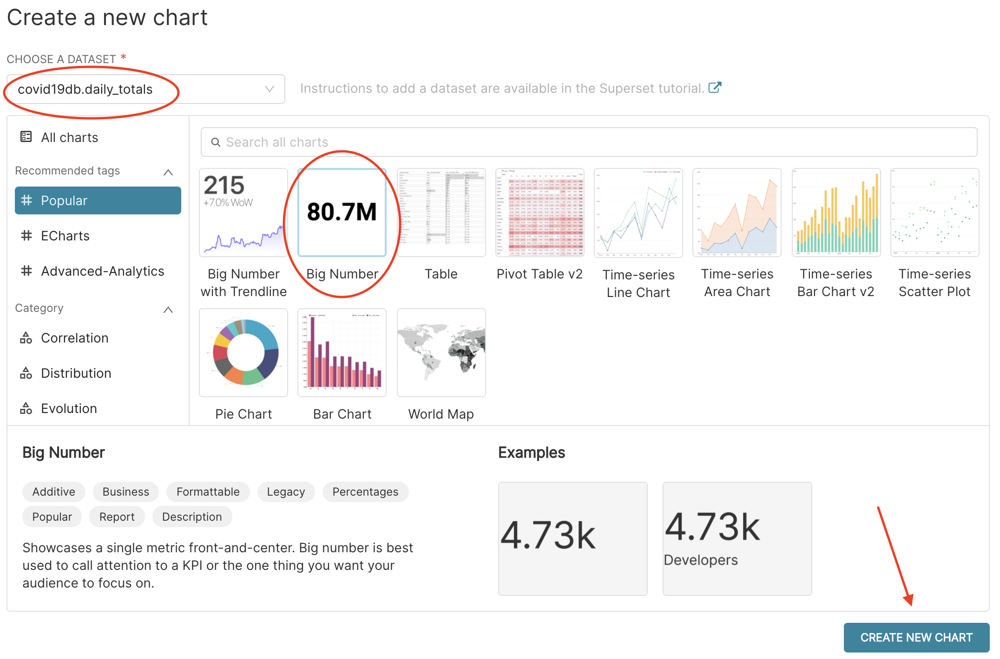


4. You need to add a metric. Let's display the total number of the `new_cases` field. Notice there is a column named **DATA** and a section named **Query** with a **METRIC** field that currently has a red warning (because it is not defined yet). Click where it says **Add metric** and a small dialog window appears:
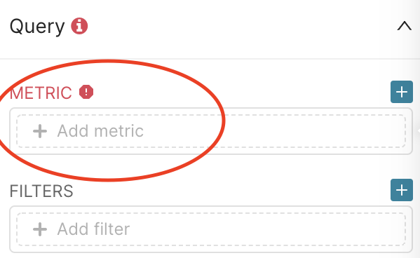


5. Select the **SIMPLE** tab, then select **new_cases** for the column and **SUM** for the aggregation:
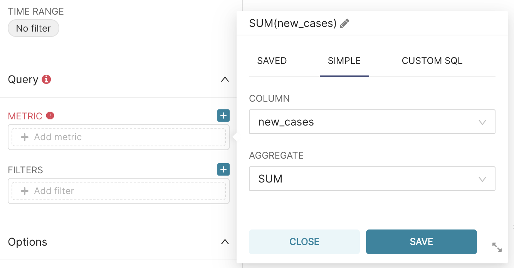


6. To view the actual number, click the **RUN QUERY** button. You will see a big number!
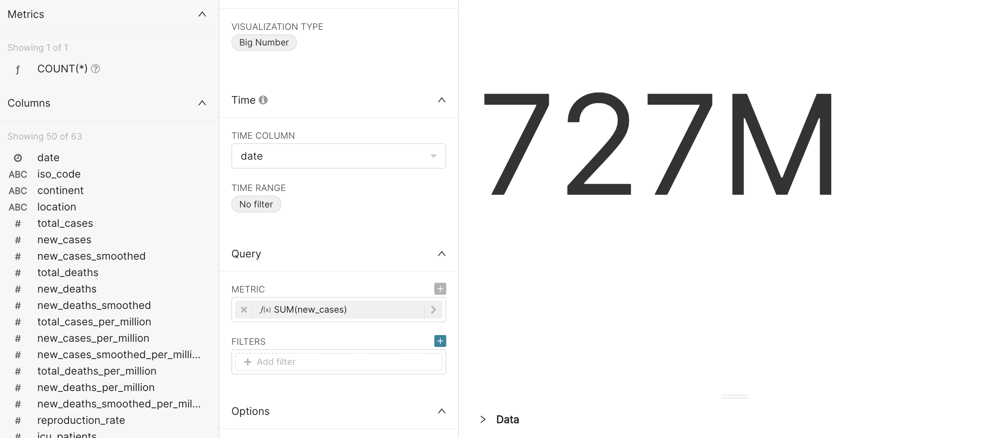


7. Change the title to **Total New Cases**, then click the **SAVE** button. Select **Covid-19 Dashboard** under the **ADD TO DASHBOARD** drop-down, then select **SAVE & GO TO DASHBOARD**. This will save the chart, add it to the dashboard, and display the dashboard:
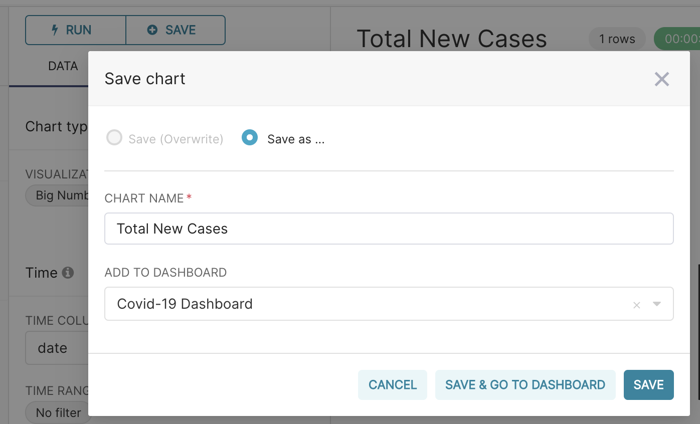
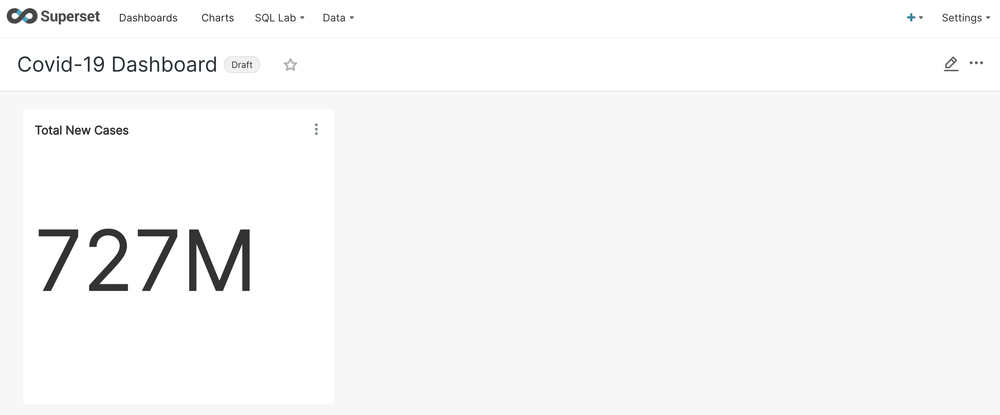





***

<button class="btn btn-primary btn-lg"  id="markcomplete">Mark as complete</button>
