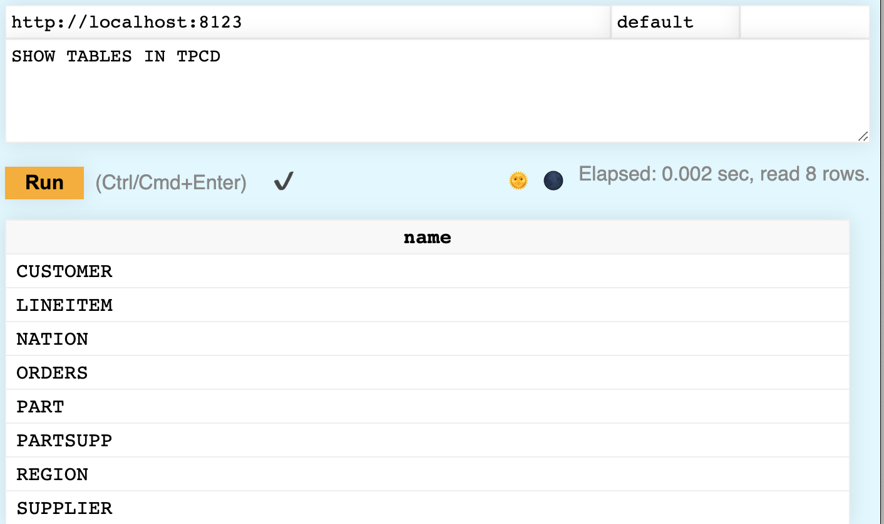
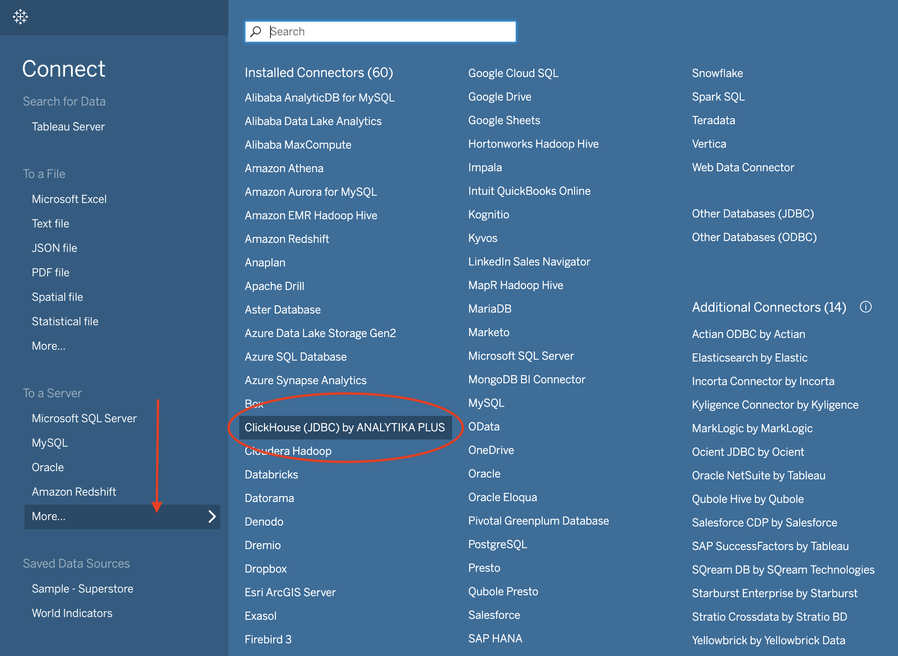
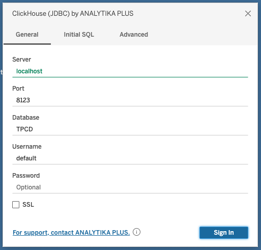
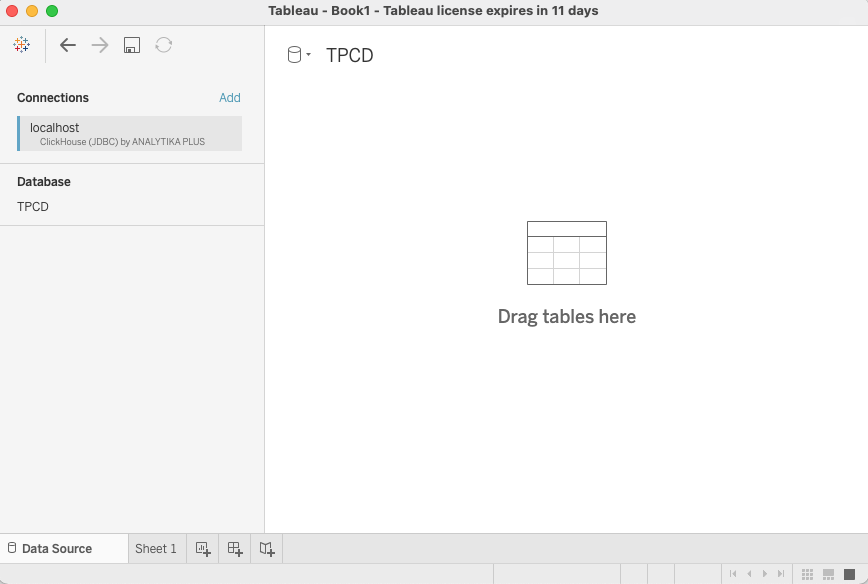

**Overview:** In this lesson, you will learn how to configure ClickHouse as a data source in Tableau. We will use the JDBC connector along with a new connector from ANALYTIKA PLUS that extends the features of the standard Tableau functionality that you get from the generic JDBC/ODBC connector. 

Let's get started!

***

### Prerequisites

- We will assume you have Tableau already
- You will need **Docker** installed and running so that you can start up a Docker Compose file

*** 

## 1. Start ClickHouse

You are going to run a preconfigured ClickHouse server in a Docker container that has some data in it already.  



1. Let's start by creating a local folder to work in (feel free to name the folder anything you like):
    ```bash
    mkdir ~/clickhouse-tableau
    cd ~/clickhouse-tableau
    ```

2. In the **clickhouse-tableau** folder, create a new file named **docker-compose.yml** and copy-and-paste the following into it:
    ```yml
    version: '3.7'
    services:
      clickhouse-server:
        image: learnclickhouse/public-repo:clickhouse-tpch-21.10
        container_name: clickhouse-server
        hostname: clickhouse-server
        ports:
          - "9000:9000"
          - "8123:8123"
          - "9009:9009"
        restart: always
        tty: true
        ulimits:
          memlock:
            soft: -1
            hard: -1
          nofile:
            soft: 262144
            hard: 262144
        deploy:
          resources:
            limits:
              memory: 2g
        cap_add:
        - IPC_LOCK
    ```

3. From a terminal, run the following command from the **clickhouse-tableau** folder:
    ```bash
    docker-compose up
    ```

4. It will take a minute - the entrypoint script has a delay to ensure that ClickHouse starts up before the database is created and populated. After about 30 seconds, <a href="http://localhost:8123/play" target="_blank">open the Play UI</a> and run the following command:
    ```sql
    SHOW TABLES IN TPCD
    ```

    You should see 8 tables:



{}
The TPC-H dataset is used for benchmarking purposes and is freely available at <a href="http://www.tpc.org/tpch/" target="_blank">http://www.tpc.org/tpch/</a>. 
{}

5. The dataset consists or products for sale, suppliers, customers and orders. Feel free to browse the contents of the various tables:
    ```sql
    SELECT * FROM TPCD.ORDERS LIMIT 100
    ```



*** 

## 2.  Download the JDBC Driver

The Tableau connector is an extension of the ClickHouse JDBC driver, so we will download the JDBC driver first.



1. Download the latest version of the ClickHouse JDBC driver at <a href="" target="_blank">https://github.com/ClickHouse/clickhouse-jdbc/releases/</a>. For this particular tutorial, <a href="https://github.com/ClickHouse/clickhouse-jdbc/releases/download/v0.3.1-patch/clickhouse-jdbc-0.3.1-patch-shaded.jar">this driver was used</a>. Make sure you download the **clickhouse-jdbc-x.x.x-shaded.jar** JAR file.

2. Store the JDBC driver in the following folder (based on your OS):

    | Operating System  | Destination folder |
    | ----------- | ----------- |
    | MacOS      |  **~/Library/Tableau/Drivers**  |
    | Windows   |  **C:\Program Files\Tableau\Drivers** |

    <br/>

    That's it. The driver will be found the next time you start Tableau.



*** 

## 3. Download the Connector

ANALYTIKA PLUS has built a handy connector for simplifying connections to ClickHouse from Tableau. You can <a href="https://github.com/analytikaplus/clickhouse-tableau-connector-jdbc" target="_blank"> view the details of the project in Github</a>. Follow these steps to download the connector...



1. The connector is built in a **taco** file (short for **Ta**bleau **Co**nnector). Download the latest version at <a href="https://github.com/analytikaplus/clickhouse-tableau-connector-jdbc/releases/" target="_blank">https://github.com/analytikaplus/clickhouse-tableau-connector-jdbc/releases/</a>. For this lesson, we downloaded **v0.1.1** of **clickhouse_jdbc.taco**.

2. Store **clickhouse_jdbc.taco** in the following folder (based on your OS):

    | Operating System  | Destination folder |
    | ----------- | ----------- |
    | MacOS      |  **~/Documents/My Tableau Repository/Connectors**  |
    | Windows   |  **C:\Users\[Windows User]\Documents\My Tableau Repository\Connectors** |

<br/>
The connector is now ready to go.



*** 

## 4.  Configure a ClickHouse data source in Tableau

Now that you have the driver and connector in the approriate folders on your machine, let's see how to define a data source in Tableau that connects to the **tpcd** database in ClickHouse.



1. Start Tableau. (If you already had it running, then restart it.)

2. From the left-side menu, click on **More** under the **To a Server** section. If everything worked properly, you should see **ClickHouse (JDBC) by ANALYTIKA PLUS** in the list of installed connectors:




3. Click on **ClickHouse (JDBC) by ANALYTIKA PLUS**  and a dialog window pops up. Enter the following details:

    | Setting  | Value |
    | ----------- | ----------- |
    | Server      |  **localhost**  |
    | Port   |  **8123** |
    | Database |  **TPCD** (case sensitive) |
    | Username | **default** |
    | Password | *leave blank* |

<br/>

Your settings shoud look like:




4. Click the **Sign In** button and you should see the **TPCD** database appear in a new workbook:



5. That's it!! You should see the **TPCD** tables and be able to build any type of visualization or table that you want in Tableau.

***

You can connect Tableau to ClickHouse using the generic ODBC/JDBC ClickHouse driver, but we really like how this tool from ANALYTIKA PLUS simplifies the process of setting up the connection. If you have any issues with the connector, feel free to reach out to ANALYTIKA PLUS on <a href="https://github.com/analytikaplus/clickhouse-tableau-connector-jdbc/issues" target="_blank">GitHub</a>.

**What's next:** Check out the following lessons to continue your journey: 

- The <a href="https://clickhouse.com/learn/lessons/logsvector">Ingest Nginx Logs into ClickHouse using Vector</a> lesson demonstrates how to stream a log file into ClickHouse
- Check out <a href="https://clickhouse.com/learn/lessons/whatsnew-clickhouse-21.10">What's New in ClickHouse 21.10</a>
- View all of our lessons on the <a href="../../index.html">Learn ClickHouse</a> home page

