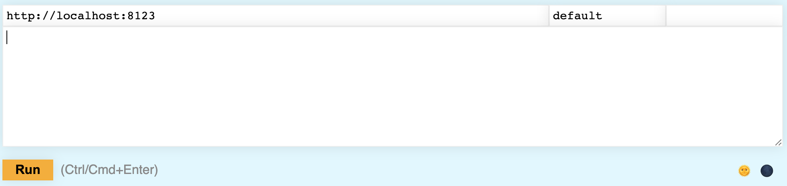
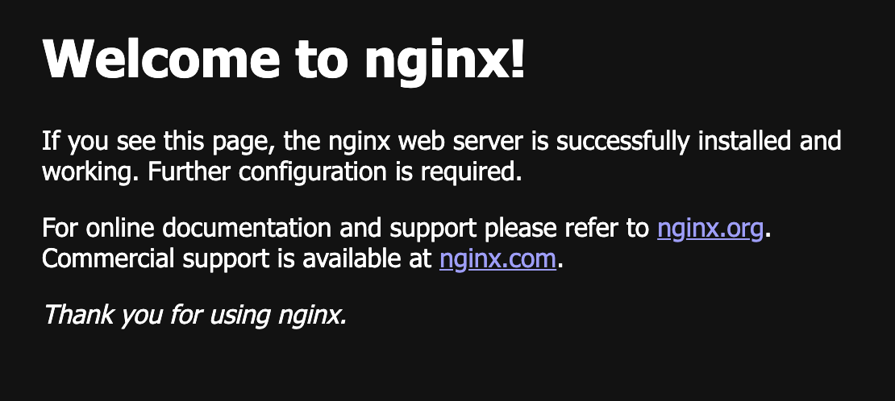
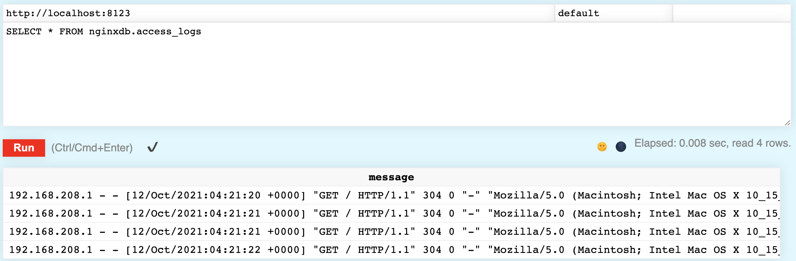

**Overview:** Being able to analyze your logs in real time is critical for production applications. Have you ever wondered if ClickHouse is good at storing and analyzing log data? Just checkout <a href="https://eng.uber.com/logging/" target="_blank">Uber's experience</a> with converting their logging infrastructure from ELK to ClickHouse. 

In this lesson, we will get you started with ingesting access logs from Nginx into into a ClickHouse table. We will be using the popular data pipeline <a href="https://vector.dev/docs/about/what-is-vector/" target="_blank">Vector</a>, which provides a simple, built-in mechanism for tailing a log file and sending it to ClickHouse. The steps below would be similar for tailing any type of log file.

Let's get started!

***

**Prerequisites:** You will need **Docker** installed if you want to follow along.

***

## 1. Startup ClickHouse

We have provided a Docker Compose file with ClickHouse in one container, and Nginx and Vector running on a second container...



1. Let's start by creating a local folder to work in (feel free to name the folder anything you like):
    ```bash
    mkdir ~/clickhouse-nginx
    cd ~/clickhouse-nginx
    ```

2. Create a new file named **docker-compose.yml**, and copy-and-paste the following into it:
    ```yml
    version: '3.7'
    services:
    clickhouse-server:
        image: learnclickhouse/public-repo:clickhouse-server-21.9
        container_name: clickhouse-server
        hostname: clickhouse-server
        ports:
        - "9000:9000"
        - "8123:8123"
        - "9009:9009"
        restart: always
        tty: true
        ulimits:
        memlock:
            soft: -1
            hard: -1
        nofile:
            soft: 262144
            hard: 262144
        cap_add:
        - IPC_LOCK


    nginx-with-vector:
        image: learnclickhouse/public-repo:nginx-vector-21.9
        container_name: nginx-with-vector
        restart: unless-stopped
        ports:
        - 80:80
        - 443:443
        - "8383:8383"
        #volumes:
        #  - ./nginx.conf:/etc/nginx/nginx.conf
        #  - ./website:/usr/share/nginx/html
        #  - './vector.toml:/vector/config/vector.toml'
    ```

{}
The **clickhouse-server-21.9** image is a simple install of ClickHouse 21.9, and the **nginx-with-vector** image extends **nginx** and contains a downloaded and unzipped install of Vector.
{}

3. Notice the **docker-compose.yml** file has three volumes defined but commented out. You will define the files for those mount points as you work through the lesson. From a terminal, run the following command from the folder where you created **docker-compose.yml**:
    ```bash
    docker-compose up &
    ```

The two containers will start up fairly quickly.



*** 

## 2. Create a database and table

Let's define a table to store the log events...



1. Open the Play UI at <a href="http://localhost:8123/play" target="_blank">http://localhost:8123/play</a>:



2. Run the following SQL in the Play UI to define a database named **nginxdb**:
    ```sql
    CREATE DATABASE IF NOT EXISTS nginxdb;
    ```

3. For starters, we are just going to insert the entire log event as a single string. Obviously this is not great format for performing analytics on the log data, but we will figure that part out later using materialized views. Run the following SQL to create a new table named **access_logs**:
    ```sql
    CREATE TABLE IF NOT EXISTS  nginxdb.access_logs (
        `message` String
    ) 
    ENGINE = MergeTree()
    ORDER BY tuple()
    ;
    ```

{}
There is not really a need for a primary key, so that is why **ORDER BY** is set to **tuple()**.
{}

That's it - ClickHouse is ready...next you will setup Nginx.



*** 

## 3.  Configure Nginx

We certainly do not want to spend too much time explaining Nginx, but we also do not want to hide all the details, so in this step we will provide you enough details get Nginx logging configured. 



1. In the **~/clickhouse-nginx** folder, create a new file named **nginx.conf** that looks like the following:
    ```bash
    user  nginx;
    worker_processes  auto;

    error_log  /var/log/nginx/error.log notice;
    pid        /var/run/nginx.pid;

    events {
        worker_connections  1024;
    }


    http {
        include       /etc/nginx/mime.types;
        default_type  application/octet-stream;

        access_log  /var/log/nginx/my_access.log combined;

        sendfile        on;
        #tcp_nopush     on;

        keepalive_timeout  65;

        #gzip  on;

        include /etc/nginx/conf.d/*.conf;
    }
    ```

{}
The key setting of interest is:
```bash
access_log  /var/log/nginx/my_access.log combined;
```

Access logs will be sent to **/var/log/nginx/my_access.log** using the **combined** format.
{}

2. Uncomment the **volume** setting in **docker-compose.yml** for the **nginx.conf** file:
    ```yml
    volumes:
      - ./nginx.conf:/etc/nginx/nginx.conf 
    ```

3. Run **docker-compose up** again to pick up the changes:
    ```bash
    docker-compose up &
    ```

4. Verify Nginx is running by viewing its default home page at <a href="http://localhost/" target="_blank">http://localhost/</a>:



5. Refresh the home page a few times to generate some log events in the access log.

6. Use the following command to cat the **my_access.log** file and verify access events are getting logged there successfully:
    ```bash
    docker exec nginx-with-vector cat /var/log/nginx/my_access.log
    ```

    You should see entries similar to the following:
    ```bash
    192.168.208.1 - - [12/Oct/2021:03:31:44 +0000] "GET / HTTP/1.1" 200 615 "-" "Mozilla/5.0 (Macintosh; Intel Mac OS X 10_15_7) AppleWebKit/537.36 (KHTML, like Gecko) Chrome/93.0.4577.63 Safari/537.36"
    192.168.208.1 - - [12/Oct/2021:03:31:44 +0000] "GET /favicon.ico HTTP/1.1" 404 555 "http://localhost/" "Mozilla/5.0 (Macintosh; Intel Mac OS X 10_15_7) AppleWebKit/537.36 (KHTML, like Gecko) Chrome/93.0.4577.63 Safari/537.36"
    192.168.208.1 - - [12/Oct/2021:03:31:49 +0000] "GET / HTTP/1.1" 304 0 "-" "Mozilla/5.0 (Macintosh; Intel Mac OS X 10_15_7) AppleWebKit/537.36 (KHTML, like Gecko) Chrome/93.0.4577.63 Safari/537.36"
    ```

You are ready to send those log events to your table in ClickHouse...



*** 

## 4.  Configure Vector

Vector collects, transforms and routes logs, metrics, and traces (referred to as **sources**) to lots of different vendors (referred to as **sinks**), including out-of-the-box compatibility with ClickHouse. Sources and sinks are defined in a configuration file named **vector.toml**. Let's define one now for your Nginx logs.



1. In the **~/clickhouse-nginx** folder, create a new file named **vector.toml** that looks like the following:
    ```bash
    [sources.nginx_logs]
    type = "file"
    include = [ "/var/log/nginx/my_access.log" ]
    read_from = "end"


    [sinks.clickhouse]
    type = "clickhouse"
    inputs = ["nginx_logs"]
    endpoint = "http://clickhouse-server:8123"
    database = "nginxdb"
    table = "access_logs"
    skip_unknown_fields = true
    ```

{}
Notice that the **source** is of type **file** and tails the end of **my_access.log**, and the **sink** is the **access_logs** table you defined earlier in your ClickHouse database.
{}

2. Uncomment the **volumes** setting in **docker-compose.yml** for the **vector.toml** file:
    ```bash
    volumes:
      - ./nginx.conf:/etc/nginx/nginx.conf
      - ./vector.toml:/vector/config/vector.toml   
    ```

3. Run **docker-compose up** again to pick up the changes:
    ```bash
    docker-compose up &
    ```

That's it. You will verify it worked in the next step. If you want more details on configuring Vector, <a href="https://vector.dev/docs/" target="_blank">visit the Vector documentation</a>.



*** 

## 5. View the logs in ClickHouse

Let's verify the access logs are being inserted into ClickHouse...



1. Reload the home page at <a href="http://localhost/" target="_blank">http://localhost/</a> a few times. 

2. From <a href="http://localhost:8123/play" target="_blank">the Play UI</a>, run the following query:
    ```sql
    SELECT * FROM nginxdb.access_logs
    ```

    You should see the access logs in the table:
    

Congrats - you did it! Notice how easy it would be to tail your own log file - just install Vector on the machine with the log file and configure the **source** to point to your log file.
    


*** 

**What's next:** Check out the following lessons to continue your journey: 

- <a href="../whatsnew-clickhouse-21.10">What's New in ClickHouse 21.10</a>
- You can view all of our lessons on the <a href="../../index.html">Learn ClickHouse</a> home page