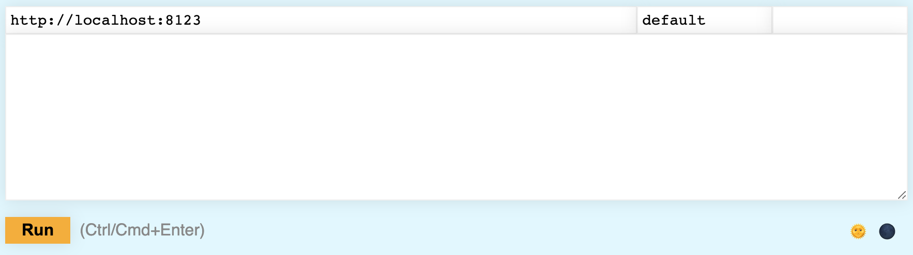
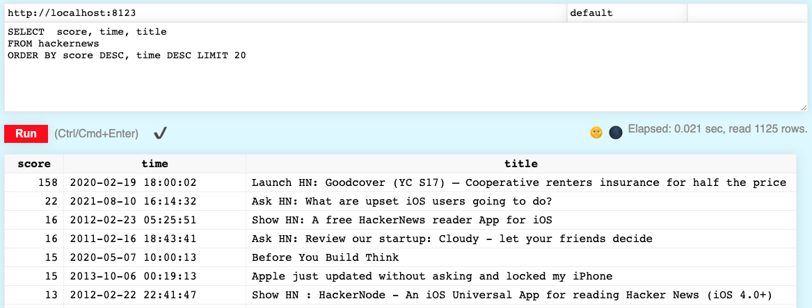

**Overview:** In this lesson, we will use a table of Hacker News stories and comments to demonstrate some of the new features of ClickHouse 21.10, including user-defined functions (UDF), materialized columns, positional arguments, and throttling the number of events sent to the query log.

Let's get started!

***

**Prerequisites:** You will be running a Docker Compose file that uses an image with ClickHouse 21.10, Python, and a sample dataset already indexed that contains some Hacker News comments and stories, so you will need **Docker** installed to be able to follow along.

*** 

## 1. Startup ClickHouse 21.10

The first step is get ClickHouse up and running: 



1. Start by creating a folder to work in. It doesn't matter what you call it, but for practical purposes we will call it **whatsnew**:
    ```bash
    mkdir ~/whatsnew
    cd whatsnew
    ```

2. Create a new file in the **whatsnew** folder named **docker-compose.yml** that contains the following:
    ```yml
    version: '3.7'

    services:
      clickhouse-server:
        image: learnclickhouse/public-repo:clickhouse-hackernews-21.10
        container_name: clickhouse-server
        hostname: clickhouse-server
        ports:
          - "9000:9000"
          - "8123:8123"
          - "9009:9009"
        # volumes:
        #   - ./my_config.xml:/etc/clickhouse-server/users.d/my_config.xml
        #   - ./function_config.xml:/etc/clickhouse-server/config.d/function_config.xml
        #   - ./my_function.xml:/etc/clickhouse-server/my_function.xml
        #   - ./log_query_config.xml:/etc/clickhouse-server/users.d/log_query_config.xml
        tty: true
        ulimits:
          nofile:
            soft: 262144
            hard: 262144
        cap_add:
        - IPC_LOCK
    ```

Notice the volumes are commented out - you will uncomment those later.

3. Start up the **docker-compose.yml** file;
    ```bash
    docker-compose up &
    ```

4. Wait about 30 seconds for the **clickhouse-server** container to startup, and also for the data to get inserted into the **hackernews** table of the **default** database.

5. Point your web browser to <a href="http://localhost:8123/play" target="_blank">http://localhost:8123/play</a>. You should see the embedded ClickHouse Play UI:

    

6. Let's run a few queries to understand what the dataset looks like. Copy-and-paste the following query into the Play UI, then click the **Run** button (or press **Ctrl/Cmd+Enter**). You will see the column names and data types of the **hackernews** table:
    ```sql
    describe hackernews
    ```

7. Make sure you have 1,125 rows:
    ```sql
    select count(*) from hackernews
    ```

8. View some of the data in the table:
    ```sql
    select * from hackernews limit 100
    ```

You are now ready to try out some of the new features... 



*** 

## 2. Positional Arguments 

It is considered a best practice to use column names in ORDER BY and GROUP BY clauses. For example, the following query groups by **foo** then **baz**:
```sql
SELECT foo, bar, baz
FROM my_table
GROUP BY foo, baz
```

With positional arguments, the following query is identical to the previous query:
```sql
SELECT foo, bar, baz
FROM my_table
GROUP BY 1,3
```

Let's try it out...



{}
You need to set **enable_positional_arguments** to **1** in order to use positional arguments (they are disabled by default). You can use `SET enable_positional_arguments=1;`, but this lesson uses the Play UI which does not allow multiple SQL commands, so we will need to configure this setting in a config file.
{}

1. To set the **enable_positional_arguments** property, we will take advantage of the **users.d** folder - where config files are automatically loaded at startup. Create a new file named **my_config.xml** that contains the following XML and save it in your **~/whatsnew/** folder (where you saved **docker-compose.yml**):
    ```xml
    <?xml version="1.0"?>
    <yandex>
        <profiles>
            <default>
                <enable_positional_arguments>1</enable_positional_arguments>
            </default>
        </profiles>
    </yandex>
    ```

2. Uncomment the **volume** setting in your **docker-compose.yml** file that mounts your local **my_config.xml** to **/etc/clickhouse-server/users.d/**:
    ```yml
    volumes:
      - ./my_config.xml:/etc/clickhouse-server/users.d/my_config.xml
    ```

3. Restart your Docker container by running the following command in the **~/whatsnew** folder:
    ```bash
    docker-compose up &
    ```

4. Verify that **enable_positional_arguments** is set properly by running the following command in the Play UI. You should get **1** for a response:
    ```sql
    SELECT getSetting('enable_positional_arguments');
    ```

4. Run the following query, which sorts the top 20 stories by score, then date:
    ```sql
    SELECT  score, time, title from hackernews order by score desc, time desc limit 20
    ```

    


5. The following query is identical, but uses positional arguments:
    ```sql
    SELECT  score, time, title from hackernews order by 1 desc, 2 desc limit 20
    ```

You should see the same 20 rows sorted in the same order as the previous query.



*** 

## 3.  The Executable Table Engine

ClickHouse 21.10 introduces two new table engines: **Executable** and **ExecutablePool**, which both allow you to execute a query and pass the results to a custom script that you write. Let's see how they work by looking at an example.



1. hello



*** 

## 4.  Limiting the Query Log

When you submit a query to ClickHouse, the start and end time of the query is logged in a table named **system.query_log**. If your application is processing a large number of queries per second, then logging those query details can add a lot of load to your system. With the new **log_queries_probability** property, you can reduce that load by only logging a subset of those queries. Let's see how it works...




1. Run the following query to view the **system.query_log** table:
    ```sql
    select * from system.query_log
    ```

You should see all the queries that you have executed so far in this lesson. Notice that successful queries have two entries in the table: **QueryStart** and **QueryFinish**.

2. Sort the results so that the most recent logs appear first:
    ```sql
    select * from system.query_log order by event_time_microseconds desc
    ```

3. The default value of **log_queries_probability** is **1**, which means 100% of queries will be logged. Run the following query three times, then look in the **system.query_log** table - you will see that all 3 executions were logged.
    ```sql
    SELECT  max(score) as max_score, toDate(time) as day, any(title) as any_title from hackernews group by day order by max_score desc limit 10
    ```

4. Now let's change the value of **log_queries_probability** to 0.25, so that only 25% of queries get logged. Create a new file named **log_query_config.xml** and save it in your **~/whatsnew/** folder:
    ```xml
    <?xml version="1.0"?>
    <yandex>
        <profiles>
            <default>
          <log_queries_probability>0.25</log_queries_probability>
            </default>
        </profiles>
    </yandex>
    ```

5. Uncomment the following line in **docker-compose.yml** to mount the XML file to **/etc/clickhouse-server/users.d/**:
    ```yml
    - ./log_query_config.xml:/etc/clickhouse-server/users.d/log_query_config.xml
    ```

6. Restart the Docker container:
    ```bash
    docker-compose up &
    ```

7. Run the following query 10 times - a simple query that returns 20 random rows:
    ```sql
    SELECT  * from hackernews order by rand() limit 20
    ```

8. View the **system.query_log** table again:
    ```sql
    select * from system.query_log order by event_time_microseconds desc
    ```

    Notice that only 3 of the 10 queries were logged. 

{}
If you set **log_queries_probability** to **0**, no queries will get logged in **system.query_log**.
{}




*** 

## 5.  Materialize a Column




1. hello
    


*** 

**What's next:** If you are new to ClickHouse, be sure to check out the <a href="../gettingstarted/">Getting Started</a> lesson. You can view all of our lessons on the <a href="../../index.html">Learn ClickHouse</a> home page


